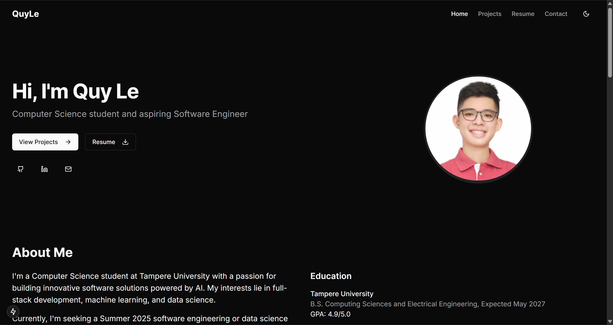

# Personal Portfolio Website

A personal website where I showcase what I have done, what I am doing, and what I want to achieve.



## Features

- 📱 Fully responsive design
- 🌓 Dark/light mode toggle
- 📂 Project showcase with GitHub links
- 📄 Downloadable resume
- 📊 Skills visualization
- 🏆 Certifications and awards section
- 📬 Contact form

## Tech Stack

- **Framework**: Next.js 14 (App Router)
- **Language**: TypeScript
- **Styling**: Tailwind CSS
- **Components**: shadcn/ui
- **Icons**: Lucide React

## Quick Start

```bash
# Install dependencies
npm install

# Run development server
npm run dev

# Build for production
npm run build

# Start production server
npm start
```